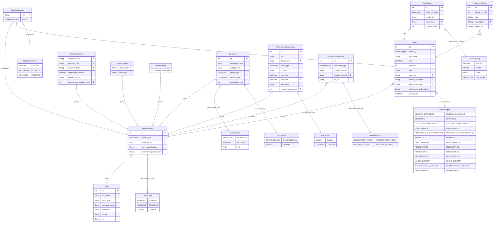

```mermaid
erDiagram

        DentistType {
            STUDENT STUDENT
ACADEMIC ACADEMIC
CLINICAL CLINICAL
        }
    


        StudyType {
            GOVERNMENTAL GOVERNMENTAL
PRIVATE PRIVATE
        }
    


        DegreeLevel {
            BACHELORS BACHELORS
MASTERS MASTERS
PHD PHD
        }
    


        PlaceType {
            CLINIC CLINIC
COLLEGE COLLEGE
        }
    


        DocumentType {
            REGISTRATION_PROOF REGISTRATION_PROOF
MEDICAL_LICENSE MEDICAL_LICENSE
        }
    


        AssetCategory {
            BEFORE BEFORE
AFTER AFTER
XRAY XRAY
LAB_WORK LAB_WORK
        }
    


        CollaboratorStatus {
            PENDING PENDING
ACCEPTED ACCEPTED
REJECTED REJECTED
        }
    


        CaseCategory {
            GENERAL_DIAGNOSIS GENERAL_DIAGNOSIS
OPERATIVE OPERATIVE
FIXED_PROSTHODONTICS FIXED_PROSTHODONTICS
ENDODONTICS ENDODONTICS
REMOVABLE_PROSTHODONTICS REMOVABLE_PROSTHODONTICS
IMPLANTS IMPLANTS
ORAL_MEDICINE ORAL_MEDICINE
PERIODONTICS PERIODONTICS
PEDODONTICS PEDODONTICS
ORTHODONTICS ORTHODONTICS
MINOR_SURGERY MINOR_SURGERY
MAXILLOFACIAL_SURGERY MAXILLOFACIAL_SURGERY
RADIOGRAPHS RADIOGRAPHS
        }
    
  "User" {
    Int id "🗝️"
    String first_name 
    String last_name 
    String personal_email 
    String password 
    String phone 
    String ssn 
    }
  

  "DentistProfile" {
    Int id "🗝️"
    DentistType dentist_type 
    String career_email "❓"
    String main_specialization 
    String secondary_specialization 
    }
  

  "ProfileAcademic" {
    String academic_rank "❓"
    String teaching_field "❓"
    String research_field "❓"
    Boolean supervises_students 
    String courses_taught 
    Int approximate_student_count "❓"
    }
  

  "ProfileClinical" {
    String clinic_name "❓"
    String work_type "❓"
    }
  

  "ProfileStudent" {
    Int current_study_year 
    }
  

  "Education" {
    Int id "🗝️"
    String university_name 
    String college_name 
    StudyType study_type 
    DegreeLevel degree_level 
    Int graduation_year 
    }
  

  "ProfessionalExperience" {
    Int id "🗝️"
    String title 
    String department "❓"
    PlaceType place_type 
    String location 
    DateTime start_date 
    DateTime end_date "❓"
    String description "❓"
    Int years_of_experience "❓"
    }
  

  "VerificationDocument" {
    Int id "🗝️"
    DocumentType document_type 
    String license_number "❓"
    String issuing_authority "❓"
    String file_url 
    }
  

  "Case" {
    Int id "🗝️"
    CaseCategory category 
    String procedure 
    DateTime date 
    Int duration "❓"
    String title 
    String overview "❓"
    String clinical_summary "❓"
    String clinical_outcome "❓"
    String techniques_and_methods 
    DateTime created_at 
    }
  

  "CaseAsset" {
    Int id "🗝️"
    AssetCategory asset_category 
    String media_url 
    String description "❓"
    Int display_order "❓"
    }
  

  "TreatmentPhase" {
    Int id "🗝️"
    Int phase_number 
    String title 
    String description "❓"
    String photo_url "❓"
    }
  

  "CaseCollaborator" {
    String role "❓"
    CollaboratorStatus status 
    }
  
    "DentistProfile" |o--|| "DentistType" : "enum:dentist_type"
    "DentistProfile" |o--|| "User" : "user"
    "ProfileAcademic" |o--|| "DentistProfile" : "profile"
    "ProfileClinical" |o--|| "DentistProfile" : "profile"
    "ProfileStudent" |o--|| "DentistProfile" : "profile"
    "Education" |o--|| "StudyType" : "enum:study_type"
    "Education" |o--|| "DegreeLevel" : "enum:degree_level"
    "Education" }o--|| "DentistProfile" : "profile"
    "ProfessionalExperience" |o--|| "PlaceType" : "enum:place_type"
    "ProfessionalExperience" }o--|| "DentistProfile" : "profile"
    "VerificationDocument" |o--|| "DocumentType" : "enum:document_type"
    "VerificationDocument" }o--|| "DentistProfile" : "profile"
    "Case" |o--|| "CaseCategory" : "enum:category"
    "Case" }o--|| "DentistProfile" : "owner"
    "CaseAsset" |o--|| "AssetCategory" : "enum:asset_category"
    "CaseAsset" }o--|| "Case" : "case"
    "TreatmentPhase" }o--|| "Case" : "case"
    "CaseCollaborator" |o--|| "CollaboratorStatus" : "enum:status"
    "CaseCollaborator" }o--|| "Case" : "case"
    "CaseCollaborator" }o--|| "DentistProfile" : "collaborator"
```
