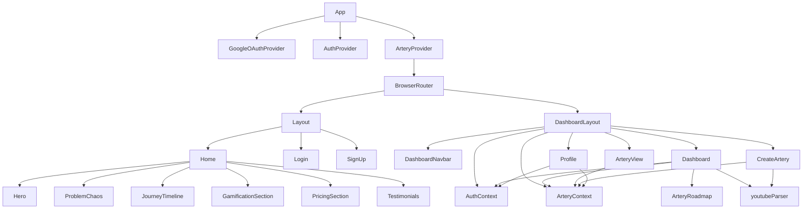

# Khatwa Frontend — Full Project Documentation
> **Project:** `YousefElbooz/Khatwa` | `c:\Users\Yousef\Desktop\FrontEnd\khatwa-react`
> **Last Updated:** 2026-03-12 | **Stage:** Thick Prototype (Steps 1–3 complete, Steps 4–5 pending)

---

## 1. Project Overview

**Khatwa (خطوة)** is an Arabic-language, gamified learning pathway platform. The core concept is "Arteries" (شرايين) — structured, sequential learning paths a user commits to and tracks daily. The product combines:

- A **marketing landing page** explaining the product value proposition
- **Authentication pages** (Login + Sign Up, including Google OAuth)
- A **protected Dashboard** with Pomodoro focus sessions, roadmap visualization, artery management, and user profile
- A **Thick Prototype** global state layer (Steps 1–3) simulating full business logic via localStorage

The UI is fully **RTL Arabic**, dark-mode glassmorphism, neon teal (`#00e5ff`) accent, GSAP animations throughout.

---

## 2. Technology Stack

| Technology | Version | Role |
|---|---|---|
| **React** | 18.3.1 | UI framework |
| **Vite** | 7.3.1 | Build tool & dev server |
| **React Router DOM** | 7.13.1 | Client-side routing |
| **TailwindCSS** | 3.4.19 | Utility-first CSS |
| **GSAP** | 3.14.2 | Animation library |
| **@react-oauth/google** | 0.13.4 | Google One Tap / OAuth |
| **@react-three/fiber** | 8.15.12 | 3D rendering (Three.js) |
| **@react-three/drei** | 9.96.1 | 3D helpers |
| **lucide-react** | 0.577.0 | Icon library |
| **react-icons** | 5.6.0 | Additional icons (FI set) |
| **axios** | 1.13.6 | HTTP client (**installed but not yet used**) |

**Deployment:** `vercel.json` with SPA rewrite rule — ready for Vercel.

**Dev server:** `npm run dev`

---

## 3. File & Folder Structure

```
khatwa-react/
├── public/                     # Static assets (logo.png)
├── src/
│   ├── App.jsx                 # Root: provider tree + route definitions
│   ├── main.jsx                # React DOM entry point
│   ├── index.css               # Global CSS + Tailwind directives
│   │
│   ├── context/
│   │   ├── AuthContext.jsx     # Global auth state: user, token, XP
│   │   └── ArteryContext.jsx   # ★ NEW — Global artery + gamification state
│   │
│   ├── utils/
│   │   └── youtubeParser.js    # YouTube URL parser + playlist HTML scraper
│   │
│   ├── components/
│   │   ├── Layout.jsx          # Public wrapper (Navbar + Footer)
│   │   ├── Navbar.jsx          # Public marketing navbar
│   │   ├── DashboardNavbar.jsx # Dashboard top bar
│   │   ├── Footer.jsx          # Public footer
│   │   ├── ScrollToTop.jsx     # Scroll reset on route change
│   │   ├── Hero.jsx            # Landing hero section
│   │   ├── Hero3DScene.jsx     # Three.js 3D animation in hero
│   │   ├── ProblemChaos.jsx    # "Problems we solve" section
│   │   ├── JourneyTimeline.jsx # How it works timeline
│   │   ├── GamificationSection.jsx
│   │   ├── PricingSection.jsx
│   │   ├── Testimonials.jsx    # Auto-looping testimonials carousel
│   │   └── constants.js        # Static data (leaderboard, feature cards)
│   │
│   └── pages/
│       ├── Home.jsx            # Landing page (assembles all sections)
│       ├── Auth/
│       │   ├── Login.jsx       # Login form + Google OAuth
│       │   └── SignUp.jsx      # Sign up form
│       └── Dashboard/
│           ├── DashboardLayout.jsx  # Protected layout: sidebar + Outlet
│           ├── Dashboard.jsx        # ★ Focus session + roadmap tab
│           ├── ArteryRoadmap.jsx    # "نهر التدفق" visual roadmap
│           ├── ArteryView.jsx       # ★ Artery management (live context)
│           ├── CreateArtery.jsx     # ★ 3-step wizard (calls addArtery)
│           └── Profile.jsx          # ★ User profile (live stats)
│
├── vercel.json                # Vercel SPA rewrite config
├── vite.config.js
├── tailwind.config.js         # Custom color tokens
└── package.json
```

★ = **Modified in Thick Prototype phase**

---

## 4. Provider Tree & Routing

### Provider Tree (`App.jsx`)
```
GoogleOAuthProvider
  └─ AuthProvider          (user, token, XP — synced to localStorage)
       └─ ArteryProvider   (arteries, stats — synced to localStorage) ★ NEW
            └─ BrowserRouter
```

### Routes
```
/              → <Layout><Home />          (public)
/login         → <Layout><Login />         (public)
/signup        → <Layout><SignUp />        (public)
/dashboard     → <DashboardLayout>         (protected — redirects to /login if no user)
  /dashboard              →  <Dashboard />
  /dashboard/artery       →  <ArteryView />
  /dashboard/create-artery → <CreateArtery />
  /dashboard/profile      →  <Profile />
```

---

## 5. State Management (Current Architecture)

### 5.1 AuthContext (`src/context/AuthContext.jsx`)

| Exposed | Type | Description |
|---|---|---|
| `user` | `{ id, name, email, xp }` | Current logged-in user |
| `token` | `string \| null` | JWT (currently a mock string) |
| `loading` | `boolean` | True while restoring session from localStorage |
| `login(userData, token)` | fn | Persists user + token to localStorage |
| `logout()` | fn | Clears state + localStorage |
| `addXP(amount)` | fn | Increments `user.xp` locally + persists |

**Persistence:** `user` and `token` stored as JSON in `localStorage`.
**⚠️ No real token verification** — localStorage restore only, no backend `GET /auth/me` call.

---

### 5.2 ArteryContext ★ NEW (`src/context/ArteryContext.jsx`)

| Exposed | Type | Description |
|---|---|---|
| `arteries` | `Artery[]` | Full list of all user arteries |
| `activeArtery` | `Artery \| null` | Derived: `arteries.find(a => a.isActive)` |
| `stats` | `{ streak, freezeDays, totalFocusHours, rank }` | Gamification stats |
| `addArtery(data)` | fn | Creates artery, sets it active, deactivates others |
| `removeArtery(id)` | fn | Deletes artery by id |
| `setActiveArtery(id)` | fn | Switches active artery |
| `completeCurrentStep(minutesFocused)` | fn | Advances progress + streak + focus hours, returns XP |
| `updateStats(patch)` | fn | Partial update to stats object |

**Persistence:** Both `arteries` and `stats` auto-sync to `localStorage` via `useEffect`.

**localStorage keys:**
- `khatwa_arteries` — array of Artery objects
- `khatwa_stats` — gamification stats object

**Seed data:** On first load (empty localStorage), 2 demo arteries are pre-seeded.

**XP Formula (inside `completeCurrentStep`):**
```
XP = 50 (base) + min(minutesFocused, 45) (focus bonus)
Max per step = 95 XP
```

---

### 5.3 Artery Data Shape

```js
{
  id: 'artery_1741234567890',    // unique timestamp-based ID
  name: 'إتقان React.js',        // display name
  goalName: 'إتقان React.js',    // full goal description
  type: 'playlist' | 'video' | 'custom',
  youtubeUrl: 'https://...',
  videoId: 'abc123' | null,
  playlistId: 'PLxyz' | null,
  durationDays: 30,
  dailyHours: 2,
  intensity: 'متوسط',
  totalSteps: 30,
  completedSteps: 14,
  progress: 47,                  // percentage 0–100
  isActive: true,
  color: 'from-primary to-blue-600',  // Tailwind gradient classes
  createdAt: '2026-03-12T...',
}
```

---

## 6. Pages & Features — Current State

### 6.1 Landing Page (`/`)
Sections in order: `Hero` → `ProblemChaos` → `JourneyTimeline` → `GamificationSection` → `PricingSection` → `Testimonials`

All sections are pure UI — no interactive backend calls. Static data from `constants.js`.

### 6.2 Auth Pages

#### Login (`/login`)
- Standard email/password form
- Google OAuth via `<GoogleLogin>` component
- **`handleStandardLogin`**: mocked — creates fake user after 1s delay, calls `login()`, navigates to `/dashboard`
- **`handleGoogleSuccess`**: mocked — creates fake Google user without verifying credential with backend

#### Sign Up (`/signup`)  
- Name, email, password, confirm password
- Mocked — no real user creation, no email verification

### 6.3 DashboardLayout (`/dashboard/*`)
- Sidebar shows: avatar, name, **live** `user.xp` from AuthContext, **live** `stats.streak 🔥` from ArteryContext ★
- Route protection: redirects to `/login` if `!user`
- Mobile FAB button to toggle sidebar

### 6.4 Dashboard — Focus Session (`/dashboard`)

**Data source:** Reads `activeArtery` from `ArteryContext` — **no longer uses `location.state`** ★

| Feature | Status |
|---|---|
| Pomodoro Timer | ✅ Working — **30s (DEV MODE)**, restore to `45 * 60` for production |
| Focus Anti-Cheat | ✅ Tab switch warning (1st = pause, 2nd = reset) |
| Playlist video fetch | ✅ Via youtubeParser CORS proxy |
| Custom playlist nav | ✅ Prev/next buttons |
| "Complete Step" button | ✅ **Fully wired** — XP calc + addXP + completeCurrentStep + GSAP confetti ★ |
| Live streak badge | ✅ Reads from `stats.streak` ★ |
| Live freeze badge | ✅ Reads from `stats.freezeDays` ★ |
| Rank display | ⚠️ Hardcoded "مبتدئ" — not yet derived from XP |
| GSAP confetti | ✅ 60 particles burst on step completion ★ |

### 6.5 ArteryRoadmap
- Receives `playlistVideos`, `currentIndex`, `arteryGoalName` from `Dashboard`
- Visual zigzag timeline: Completed (teal) / Active (pulsing) / Locked (gray)
- `currentIndex` reflects **actual** `activeArtery.completedSteps` from context post-completion ★
- GSAP stagger animation on mount

### 6.6 ArteryView (`/dashboard/artery`) ★ REFACTORED
- **Was:** local `useState([...mockData])` — reset on every page load
- **Now:** reads `arteries` directly from `ArteryContext` — persists across refreshes
- Switch artery → calls `setActiveArtery(id)` → persists to localStorage
- Delete artery → calls `removeArtery(id)` → persists to localStorage

### 6.7 CreateArtery Wizard (`/dashboard/create-artery`) ★ REFACTORED
- 3-step wizard (goal → duration → confirm)
- **Was:** `navigate('/dashboard', { state: { videoId, ... } })`
- **Now:** calls `addArtery(data)` → context → `localStorage`, then `navigate('/dashboard')` cleanly
- No data passed via router state anymore

### 6.8 Profile (`/dashboard/profile`) ★ REFACTORED
- Avatar, name (editable inline — UI only, no API call)
- **Was:** all stats hardcoded in `useState`
- **Now:** stats derived from live context:
  - XP → `user.xp` from AuthContext
  - Streak → `stats.streak` from ArteryContext
  - Finished Arteries → `arteries.filter(a => a.progress >= 100).length`
  - Focus Hours → `stats.totalFocusHours`
- Settings: notification toggle (decorative), logout button (real)

---

## 7. Utility Functions

### `youtubeParser.js`

**`parseYouTubeUrl(url)`** — handles `youtube.com/watch?v=`, `youtu.be/`, `youtube.com/embed/`, with/without `?list=`

**`fetchPlaylistVideos(playlistId)`** — uses `allorigins.win` CORS proxy to scrape YouTube HTML, extracts `ytInitialData` JSON, returns max 20 `{ title, id }` objects.

---

## 8. Current Issues (Active Bugs & Blockers)

### 🔴 Critical

| # | Issue | File | Impact |
|---|---|---|---|
| C1 | Google OAuth Client ID is a placeholder string | `App.jsx` L20 | OAuth login doesn't work at all |
| C2 | No backend — all auth is mocked | `Login.jsx`, `SignUp.jsx` | Any email/password passes |
| C3 | Timer set to 30s (DEV MODE) | `Dashboard.jsx` L76 | Must change to `45 * 60` before production |
| C4 | No real session validation — token not verified | `AuthContext.jsx` | Anyone can forge a localStorage `user` key |

### 🟠 High Priority

| # | Issue | File | Impact |
|---|---|---|---|
| H1 | Playlist scraper is fragile (HTML scraping via proxy) | `youtubeParser.js` | Breaks if YouTube or allorigins.win changes structure |
| H2 | Alert modal JSX is duplicated | `Dashboard.jsx`, `ArteryView.jsx` | Bug fixes must be applied in 2 places (Step 5 pending) |
| H3 | Mock API calls (setTimeout) are scattered | `Login.jsx`, `SignUp.jsx` | Hard to swap to real backend (Step 4 pending) |
| H4 | Rank ("مبتدئ") is hardcoded in Dashboard header | `Dashboard.jsx` L408 | Doesn't update as XP grows |
| H5 | ArteryRoadmap `currentIndex` is playlist video index, not artery step | `Dashboard.jsx` L539 | Roadmap doesn't use `activeArtery.completedSteps` directly |
| H6 | Profile name edit has no persistence | `Profile.jsx` L36 | Changes lost on refresh |
| H7 | `completeCurrentStep` can be called with no active artery | `ArteryContext.jsx` | No guard; silent bug if no artery active |

### 🟡 Medium

| # | Issue | File | Impact |
|---|---|---|---|
| M1 | "Freeze days" counter is never decremented | `ArteryContext.jsx` | Static; no daily reset logic |
| M2 | Streak resets to seed value (12) on first load | `ArteryContext.jsx` | Misleading; should start at 0 for new users |
| M3 | No guard on Create Artery if `goalName` is empty at step 3 | `CreateArtery.jsx` | Edge case: user could navigate back and forward |
| M4 | "Forgot password" link is a dead `<a href="#">` | `Login.jsx` L111 | No functionality |
| M5 | Notification toggle in Profile is decorative | `Profile.jsx` L184 | No browser Notification API connected |
| M6 | `axios` is installed but never imported or used | `package.json` | Dead dependency |
| M7 | All arteries share the same `isLoadingPlaylist` state in Dashboard | `Dashboard.jsx` | Switching arteries leaves stale loading state |
| M8 | `fetchPlaylistVideos` has no timeout or retry | `youtubeParser.js` | Hangs indefinitely if proxy is slow |

### 🟢 Low / Cosmetic

| # | Issue | File | Impact |
|---|---|---|---|
| L1 | `fetchPlaylist.js` in repo root is unused | Root | Dead file |
| L2 | `user` is destructured in Dashboard but not used (only `addXP`) | `Dashboard.jsx` L30 | Minor lint warning |
| L3 | `playlist_data.json` and `temp_playlist.html` in root | Root | Leftover testing files |
| L4 | `build_error.log` committed to repo | Root | Should be in .gitignore |
| L5 | `DashboardNavbar.jsx` has no links back to landing page | `DashboardNavbar.jsx` | UX gap |
| L6 | Seed artery "12 day streak" misleads new users | `ArteryContext.jsx` | Seed data should start at realistic values |
| L7 | GSAP confetti fires relative to card center, but card position can vary | `Dashboard.jsx` | Particles may animate off-screen on some layouts |

---

## 9. What Has Been Solved (Thick Prototype Phase)

The following issues from the original documentation are **now resolved**:

| Original Issue | Resolution |
|---|---|
| Arteries reset on every refresh | ✅ ArteryContext + localStorage persistence |
| "Complete Step" button does nothing | ✅ Fully wired: XP, progress, streak, confetti |
| XP exists but `addXP()` is never called | ✅ Called in `handleComplete` with calculated value |
| Streak counter is hardcoded | ✅ Live from `stats.streak`, increments on completion |
| All stats in Profile are hardcoded | ✅ All 4 stat cards derive from live context |
| `location.state` tunnel for artery data | ✅ Removed — context is source of truth |
| ArteryView resets artery list on refresh | ✅ Reads live from ArteryContext |
| Sidebar XP is real-time (sort of) | ✅ Sidebar shows `user.xp + stats.streak` |

---

## 10. Pending Thick Prototype Steps

### Step 4 — Centralize Mock APIs (Pending)
Create `src/services/mockApi.js` and move all scattered `setTimeout` mocks into it:

```js
// mockApi.js — planned exports
export const mockLogin(email, password)     // → { user, token }
export const mockSignUp(name, email, pass)  // → { user, token }
export const mockGenerateArtery(data)       // → Artery object
export const mockFetchUserStats()           // → stats
```

This creates a **single swap point**: when the real backend is ready, replace `mockApi.js` implementations with real `axios` calls — all consumer components stay unchanged.

**Files to refactor:** `Login.jsx`, `SignUp.jsx`, `CreateArtery.jsx`

### Step 5 — Extract AlertModal Component (Pending)
The glassmorphism alert modal JSX (~60 lines) is currently **duplicated** in:
- `Dashboard.jsx` (lines ~328–400)
- `ArteryView.jsx` (lines ~62–140)

**Plan:** Create `src/components/ui/AlertModal.jsx`:
```jsx
// Accepts: { show, title, message, type, onConfirm, onClose }
export function AlertModal({ show, title, message, type, onConfirm, onClose }) {
  // single implementation
}
```

---

## 11. Backend API Contracts Needed (Future)

When connecting a real backend, these endpoints are required to replace mock logic:

### Authentication
| Endpoint | Method | Payload | Response |
|---|---|---|---|
| `/api/auth/register` | POST | `{ name, email, password }` | `{ user, token }` |
| `/api/auth/login` | POST | `{ email, password }` | `{ user, token }` |
| `/api/auth/google` | POST | `{ googleCredential }` | `{ user, token }` |
| `/api/auth/me` | GET | Bearer token | `{ user }` |
| `/api/auth/logout` | POST | Bearer token | 200 OK |

### Arteries
| Endpoint | Method | Payload | Response |
|---|---|---|---|
| `/api/arteries` | GET | — | `Artery[]` |
| `/api/arteries` | POST | `{ goalName, youtubeUrl, durationDays, dailyHours, intensity }` | `Artery` |
| `/api/arteries/:id/activate` | PATCH | — | Updated `Artery` |
| `/api/arteries/:id` | DELETE | — | 204 |

### Gamification & Progress
| Endpoint | Method | Payload | Response |
|---|---|---|---|
| `/api/arteries/:id/complete-step` | POST | `{ summary, minutesFocused }` | `{ xpAwarded, newStreak, updatedArtery }` |
| `/api/user/stats` | GET | — | `{ xp, streak, freezeDays, rank, finishedArteries, totalFocusHours }` |
| `/api/user/profile` | PATCH | `{ name }` | Updated `user` |

### YouTube (Replace Scraper)
| Endpoint | Method | Payload | Response |
|---|---|---|---|
| `/api/youtube/playlist/:id` | GET | — | `[{ videoId, title }]` |

---

## 12. Environment Variables Needed (Not Yet Configured)

```env
VITE_GOOGLE_CLIENT_ID=your_real_google_client_id.apps.googleusercontent.com
VITE_API_BASE_URL=https://api.khatwa.app
VITE_YOUTUBE_API_KEY=your_youtube_data_api_v3_key
```

> **Important:** These must be prefixed with `VITE_` to be exposed to the browser in Vite. Currently, `App.jsx` has the Google Client ID hardcoded as a placeholder string on line 20.

---

## 13. Recommended Next Steps (Prioritized)

### Immediate (Before Any Backend Work)
1. ✅ ~~Steps 1–3: Global state, artery flow, gamification engine~~
2. **Step 4:** Create `src/services/mockApi.js` and centralize mock calls
3. **Step 5:** Extract `AlertModal` into shared component
4. **Fix C3:** Change timer back to `45 * 60` before any demo or deployment
5. **Fix H4:** Derive rank from XP thresholds (`0–500 = مبتدئ`, `500–2000 = متقدم`, etc.)
6. **Fix H5:** Pass `activeArtery.completedSteps` as `currentIndex` to `ArteryRoadmap`
7. **Fix M2:** Change seed `streak` from 12 to 0 in `ArteryContext.jsx`

### Backend Integration Phase
8. Setup backend project (Node.js/Express or FastAPI)
9. Implement `/api/auth/*` endpoints with JWT
10. Set `VITE_GOOGLE_CLIENT_ID` in `.env`, reference as `import.meta.env.VITE_GOOGLE_CLIENT_ID`
11. Replace `mockApi.js` implementations with real `axios` calls
12. Add token verification on mount in `AuthContext` (`GET /api/auth/me`)
13. Move YouTube fetching to backend (server-side YouTube Data API v3)

### Polish Phase
14. Add skeleton loaders when fetching arteries on load
15. Wire notification toggle to browser `Notification API`
16. Implement daily streak reset logic (cron or on-login check)
17. Build forgot password flow
18. Add React Error Boundaries around dashboard routes

---

## 14. Component Dependency Map



---

*Documentation last updated: 2026-03-12. Reflects Thick Prototype state after Steps 1–3. Steps 4–5 pending.*
